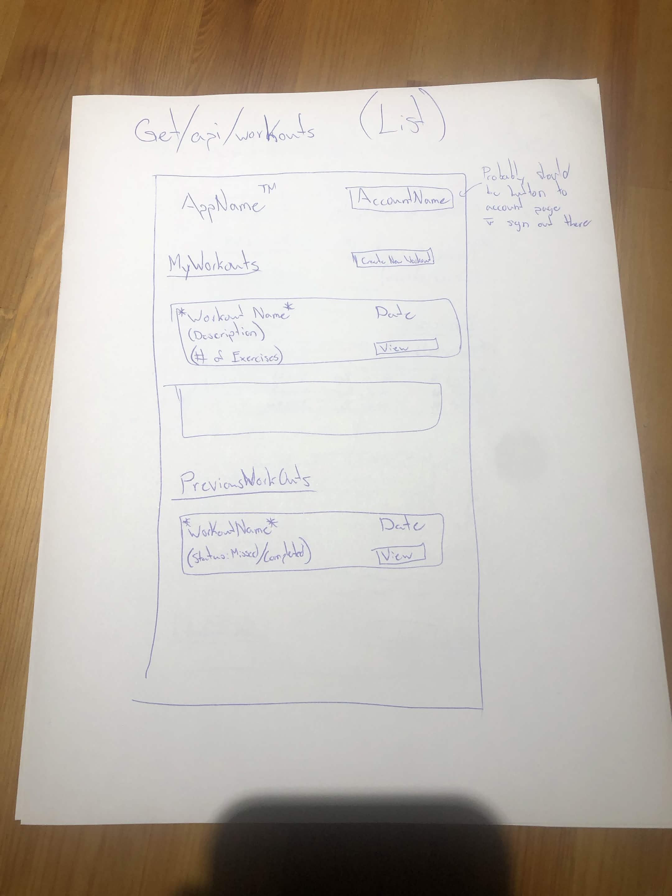
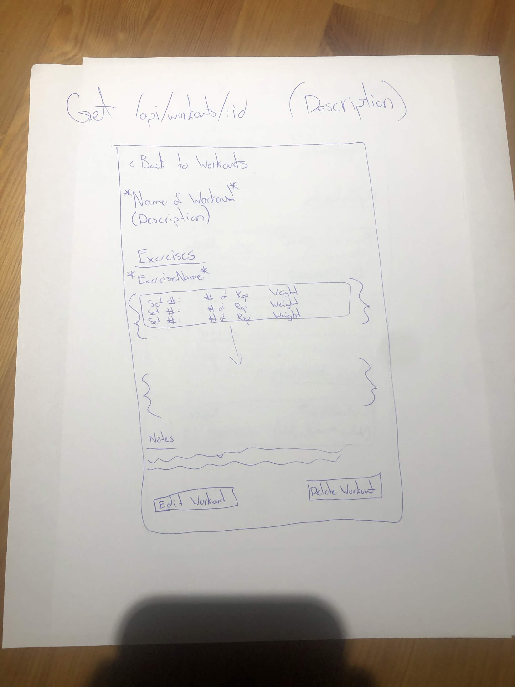
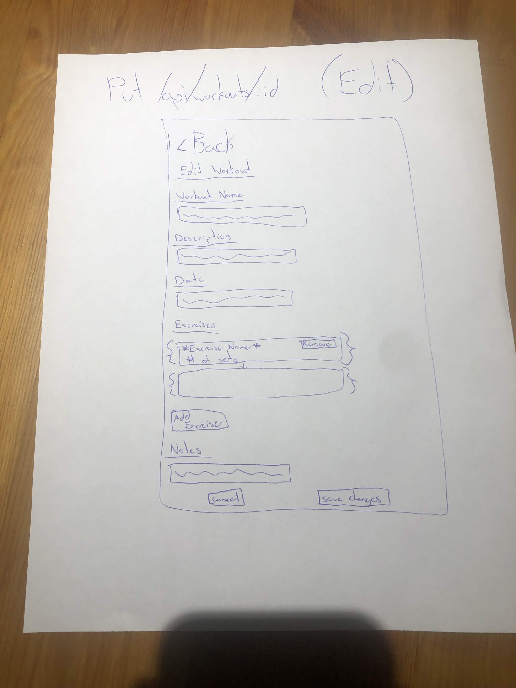
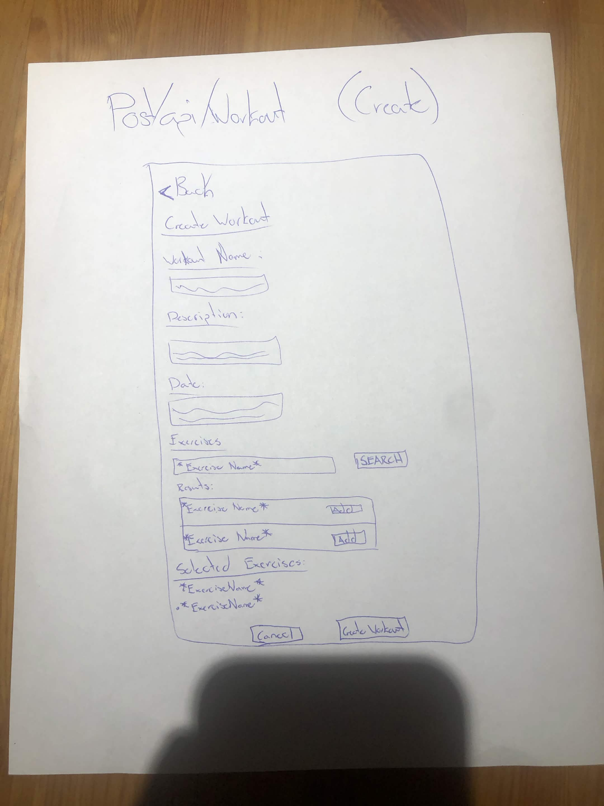

Problems and Users 
 
    While going to gym is a very honourable goal many people set out for themselves in order to keep themselves healthy, keeping track of what you have done and seeing how your reps have increases over time is not an easy or enjoyable part of it. Often times its either done on paper or done on notes in your phone, but often times as the time in the gym increaees it creates more notes that can be confusing, or harder to keep track of. Further, if these notes get to confusing it could lead to possible mix-up of what exercises were done in previous days, preventing optimal rest time and possibly causing stress on muscles that should be needing rest.

    This is where our app comes in. Our app's goal is to setup an easy way to create and track their routines, preventing an overlap of exercises and allowing user to create an easy progress ramp as they go on. We will be using the wger api to allow users to search for different exercises and add those to their previous and future routines, and store them in MongoDB.

Features

    MVP:
        1. A signed in user can create a work-out routine, with name and description
        2. A signed in user can add exercises to their work-out routine through the wger api database
        3. A signed in user can view their future routines and see the exercises in each one
        4. A signed in user can recorded a completed workout with excercises, sets, reps, and weights used
        5. A signed in user can view their previous workouts to compare their progress over time
        6. A signed in user can edit or delete their routines
        7. A signed in user can search for excerise information through the wger api database while creating or editing thier routine

    Later:
        1. Progress charts showing improvement over time (weight increase/ reps increase)
        2. Social features for sharing workouts with friends
        3. Custom exercise creations (for ones not in wger)
        4. Recommendations for future workout based on previous workouts
        5. Mobile app formatting

External API

    Name of API: wger
    Link: https://wger.readthedocs.io/en/latest/
        It does require an API key to get full access to the API and can also use "JWT Tokens."

        The rate limits are limited to a few endpoints (just to list some):
            - /allauth/app/v1/auth/login and /allauth/app/v1/auth/2fa/authenticate [5 requests/min]
            - /api/v2/ingredient/<id>/ and /api/v2/ingredientinfo/<id>/ [300 requests/min]
        The document states that exceeding a limit would return HTTP 429 with a "Retry-After" header. All other end points however are not limited (Not to worried about most of the limited endpoints as it is only with the use of implementing their food ingredient database).

        (I don't quite understand the "-and which feature uses it" but) 
            if by which feature we are using from the API, it would be to access strictly just their workout exercises database under a routine (perhaps?).
            If by which feature as in which ones have the rate limit apply then as I stated it would be their ingredient database as their GET ids and sync endpoints toll multiple requests.

        Included one real request using full URL and response (trimmed (to only the fields I believe we'll use))
            using URL: https://wger.de/api/v2/exercise/
            GET /api/v2/exercise/

            {
                "id": 9,
                "uuid": "1b020b3a-3732-4c7e-92fd-a0cec90ed69b",
                "category": 10,
                "muscles": [
                    11,
                    8
                ],
                "muscles_secondary": [
                    10,
                    6
                ],
                "equipment": [
                    10
                ],
                "variation_group": "a30b1f92-7b73-477e-abb0-e91993c5fb05"
            },
            {
                "id": 12,
                "uuid": "53906cd1-61f1-4d56-ac60-e4fcc5824861",
                "category": 9,
                "muscles": [
                    8
                ],
                "muscles_secondary": [],
                "equipment": [],
                "variation_group": "95132eef-ae4e-4185-87b8-a8588caff4fa"
            },
            {
                "id": 20,
                "uuid": "f24cb758-9c0d-42d4-ad9e-6025c527dd13",
                "category": 13,
                "muscles": [
                    2
                ],
                "muscles_secondary": [
                    9,
                    5
                ],
                "equipment": [
                    3
                ],
                "variation_group": "e3388987-305b-43b8-9e90-c3bce376b203"
            },
            {
                "id": 31,
                "uuid": "f2733700-aa5d-4df7-bc52-1876ab4fb479",
                "category": 8,
                "muscles": [],
                "muscles_secondary": [],
                "equipment": [
                    3
                ],
                "variation_group": null
            },
            {
                "id": 41,
                "uuid": "a6bced3c-72f5-42a3-9438-5569d46f49fd",
                "category": 10,
                "muscles": [
                    14
                ],
                "muscles_secondary": [],
                "equipment": [
                    1
                ],
                "variation_group": null
            },
            {
                "id": 43,
                "uuid": "dae6f6ed-9408-4e62-a59a-1a33f4e8ab36",
                "category": 9,
                "muscles": [
                    10
                ],
                "muscles_secondary": [
                    11,
                    8
                ],
                "equipment": [
                    1
                ],
                "variation_group": "ba010720-728a-4baf-ba8c-e1a37370625b"
            },
            {
                "id": 46,
                "uuid": "04e7d7e4-f8d2-406d-97df-3df3bceec22c",
                "category": 9,
                "muscles": [
                    10
                ],
                "muscles_secondary": [
                    8
                ],
                "equipment": [
                    1
                ],
                "variation_group": "c8727770-8ec1-4fe3-ae70-238a9fc46570"
            }

            (There is a lot more of the response (as  seen in the URL) but to keep it shortened the gist of the response is there along with the vital fields)

Data Model \
    For eash data type, the layout follows (field/type/required)

    User: 
        _id/ObjectID/yes
        username/String/yes
        email/String/yes
        passwordHash/String/yes
        
        A user can own many workouts

        Workout (Future/Current Workouts):
            _id/ObjectID/yes
            userid/ObjectID/yes
            name/String/yes
            description/String/no
            date/Date/yes
            status/String/yes
            exercises/Array/yes
            notes/String/no
            createdAt/Date/yes
            updatedAt/Date/yes

            A workout can contain many exercises

            Exercise Array:
                exerciseID/Number/yes
                exerciseName/String/yes
                sets/Array/yes

                Sets Array:
                    reps/Number/yes
                    weight/Number/yes

        Excerises (To be pulled from to fill Workouts):
            _id/ObjectID/yes
            userid/ObjectID/yes
            wgerid/ObjectID/yes
            name/String/yes
            description/String/no

Endpoint list   
    [method, path, what it does, successs status code, error status] 
    [list, get, create, update, delete, + external API]
        METHOD      PATH                    WHAT IT DOES                    SUCCESS STATUS CODE     ERROR STATUS
        GET         /api/workoouts          Returns workouts to user        200                     404, 500    
        GET         /api/workouts/:id       Returns workout based on ID     200                     404, 500
        GET         /api/exercises          Returns exercises to user       200                     404, 500
        GET         /api/exercises/:id      Returns exercises based on ID   200                     404, 500

        POST        /api/workoouts          Creates workout regiment        201                     409, 500
        POST        /api/exercises          Creates and adds exercise       201                     409, 500
                                            to regiment
        
        PUT         /api/workouts/:id       Updates changes made to         200                     404, 500
                                            workout
        PUT         /api/exercises/:id      Updates changes made with       200                     404, 500
                                            exercises to workout

        DELETE      /api/workouts/:id       Delete user workout regiment    204                     404, 500
        DELETE      /api/exercises/:id      Delete user saved exercises     204                     404, 500
        
Wireframes
    The wireframes are in order below, starting with the list page (essentially the homepage showing all workouts), detail page (details for a single workout), edit page (the page where you can edit a created workout), and the create page (the page that will be used when first creating a new workout). 

